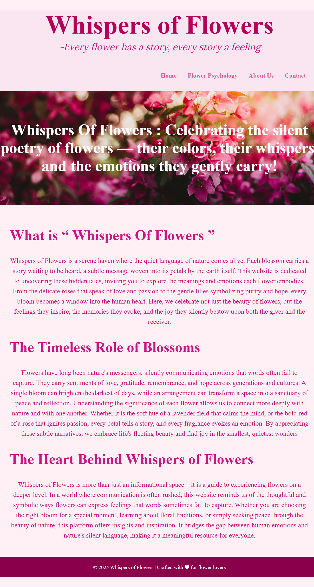
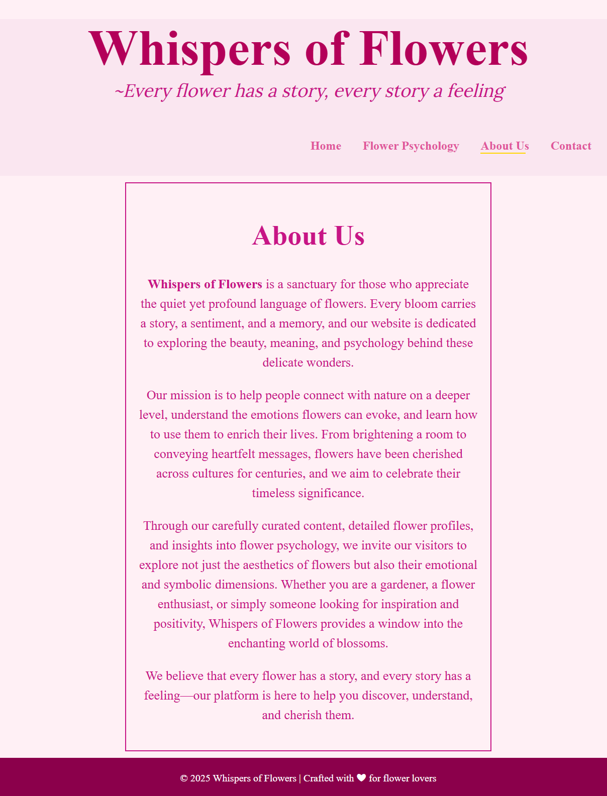
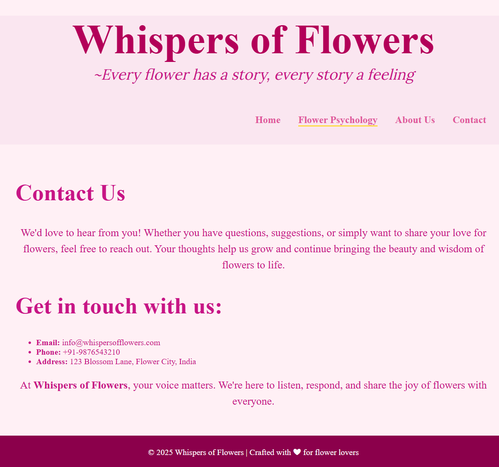

# Whispers of Flowers 🌸

## Description
**Whispers of Flowers** is an interactive and visually appealing website dedicated to exploring the beauty, meanings, and psychology of flowers. It provides users with an immersive experience, from understanding the emotional symbolism of flowers to learning their significance in daily life. The website is responsive and user-friendly, making it accessible across all devices.

The website includes the following pages:  
- **Home** – Welcoming users with a vibrant introduction to the world of flowers.  
- **Flower Psychology** – Explains the meanings, symbolism, and emotional impact of various flowers.  
- **About** – Provides insights about the inspiration and purpose behind the website.  
- **Contact** – Allows users to send inquiries or feedback easily.  

---

## Screenshots
### Home Page


### Flower Psychology Page


### About Page


### Contact Page



---

## Tools and Technologies
- **Templating Engine:** EJS (Embedded JavaScript Templates)  
- **Styling:** CSS (Responsive layouts, Flexbox/Grid, basic animations)  
- **Backend (for rendering pages):** Node.js  
- **Development Tools:** VS Code, Live Server / Node.js server  

---

## What I Learned
- Building multi-page websites with **EJS templating** for cleaner and reusable code.  
- Structuring projects with separate **views, partials, and static files**.  
- Applying **CSS layouts** (Flexbox, Grid) for responsiveness.  
- Serving static assets and integrating them with EJS templates.  

---

## How to View the Website

### Local Setup

Clone the repository:
```bash
git clone https://github.com/AnushaReddi02/Whispers-Of-Flowers.git

Navigate to the project folder:
cd Whispers-Of-Flowers

Install dependencies:
npm install


Start the server:
node index.js


Open your browser and visit:
http://localhost:3000
```

### Conclusion

Whispers of Flowers is a creative web project that combines **EJS templating**, **CSS styling**, and **Node.js** to build a simple yet elegant multi-page website.  

✨ It reflects both technical and creative skills by blending web development with the calming psychology of flowers.  

🌱 Through this project, I gained hands-on experience with **EJS**, **Node.js**, and **responsive CSS design**, making it a strong foundation for future full-stack development projects.  
